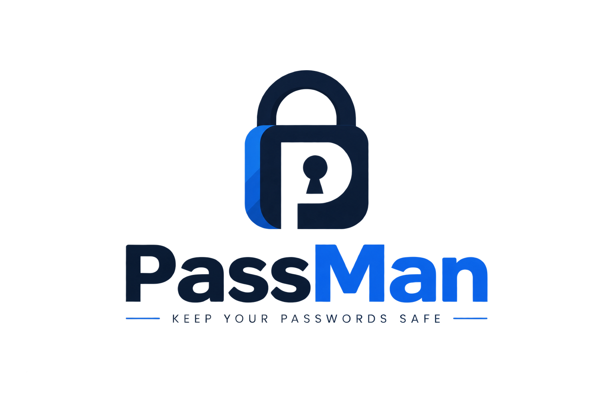

  

# PassMan

PassMan is a local password management tool.

## Why I Built This

Like a lot of people learning Python, I could have built another CRUD application. I didn't really want to make something just because everyone else was making it.

For a long time, I kept all of my passwords in a notebook. It worked, and in some ways it was safer because it was completely offline. The problem was that every time I needed a password, I had to find the notebook, flip through the pages, find the password, and type it manually.

I wanted something that fit better into how I already use my computer.

So I built PassMan.

## What It Can Do

PassMan allows you to:

* Store passwords locally
* Save the website name, email, and username associated with a password
* Encrypt passwords before storing them
* Retrieve and decrypt saved passwords
* Add and manage password entries through the CLI
* Store the encrypted data in a local SQLite database

PassMan uses a master password to derive an encryption key and uses that key to encrypt the stored passwords.

## Learning Project

PassMan is also a learning project.

I built it to learn by actually implementing the different parts myself rather than only following tutorials or copying an existing project.

AI was used for some parts of the development process, but **AI was not used for every part of the project**. Some parts were written and figured out independently as part of my learning process.

The goal of the project is not to claim that I built everything from scratch without any help. The goal is to understand what I am building and learn through the process.

## Note

PassMan is a personal project and has not been professionally audited. It is **not intended to replace established password managers**.

If you use it, use it as a personal/learning project and keep backups of your encrypted database.
at fit better into how I already use my computer.

So I built PassMan.

This isn't meant to replace professional password managers. It's a personal project that solves a problem I actually had while helping me learn by building something I would use.